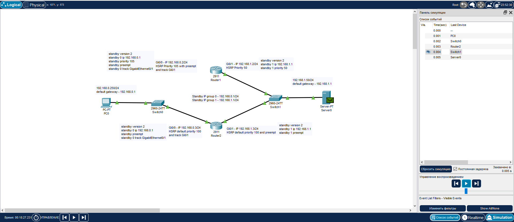
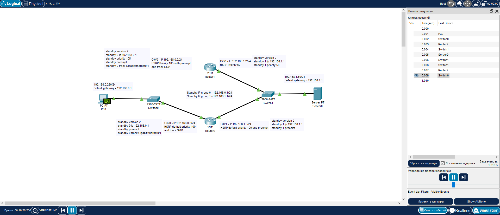
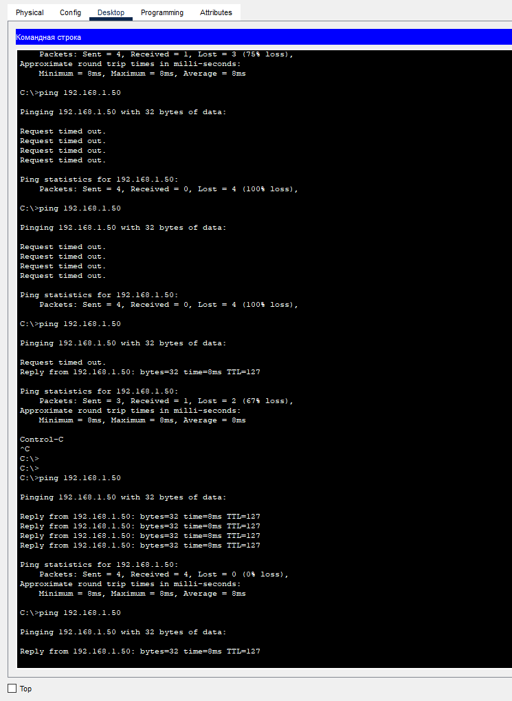

# «Disaster Recovery. FHRP и Keepalived» - Pirogov Anton

###     Задание 1 

[Файл-pkt](./files/hsrp_advanced-Pirogov.pkt)

###     Задание 2

[scriptfile](./files/scriptfile.sh)
[keepalived.conf](./files/keepalived.conf)
