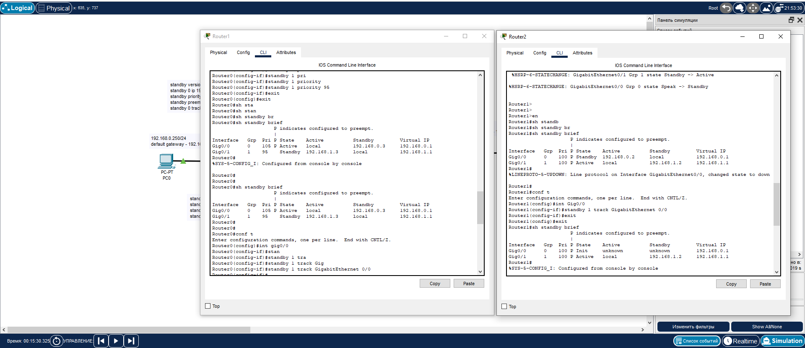
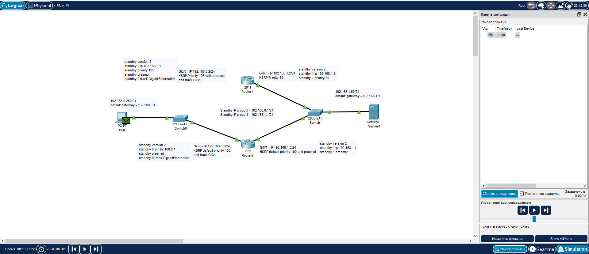
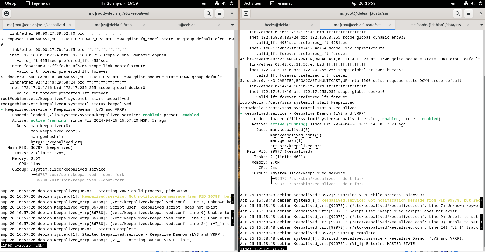
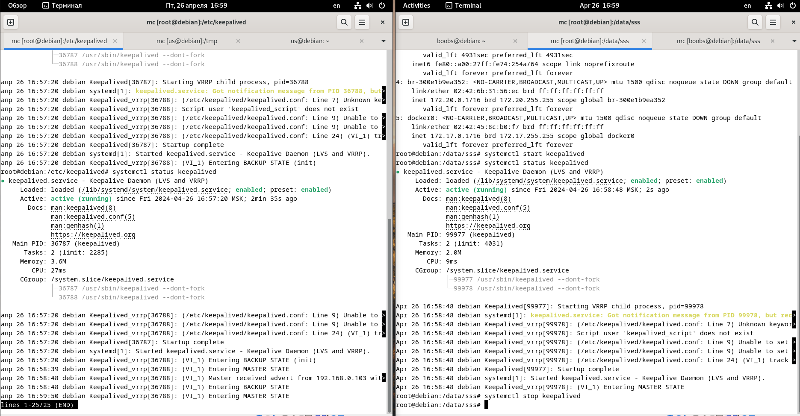
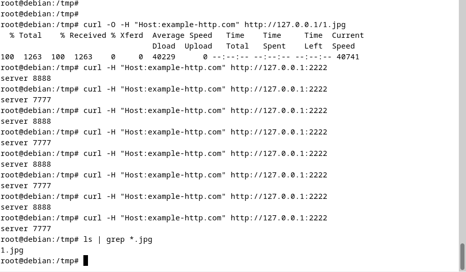
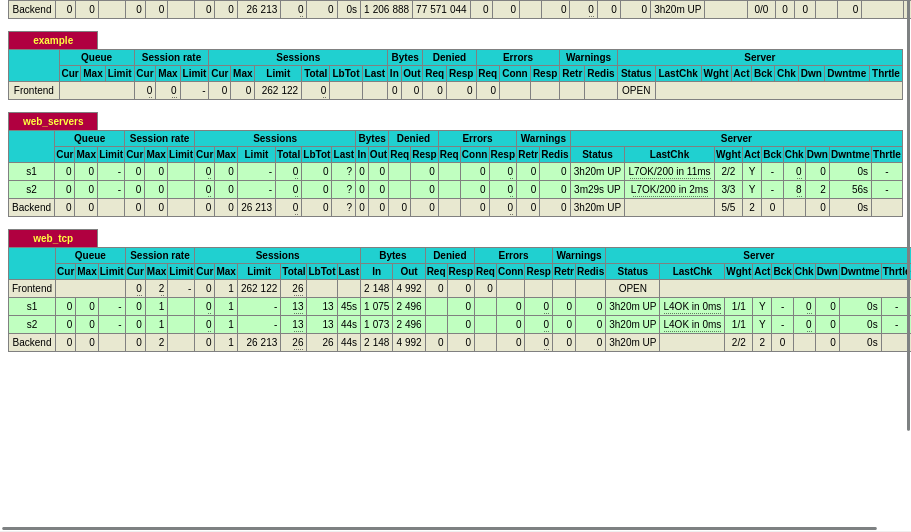

# «Disaster Recovery. FHRP и Keepalived» - Pirogov Anton

###     Задание 1 

[haproxy.cfg](./files/haproxy.cfg-ex1)

###     Задание 2

[haproxy.cfg](./files/haproxy.cfg-ex2)

###     Задание 3

[haproxy.cfg](files/haproxy.cfg-ex3)	[example-http.conf](files/example-http.conf)	[nginx.conf](files/nginx.conf)	[upstream.inc](files/upstream.inc)
